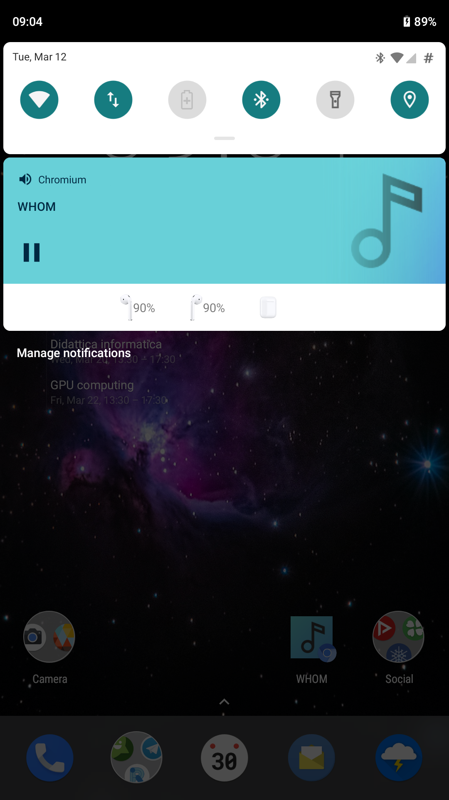
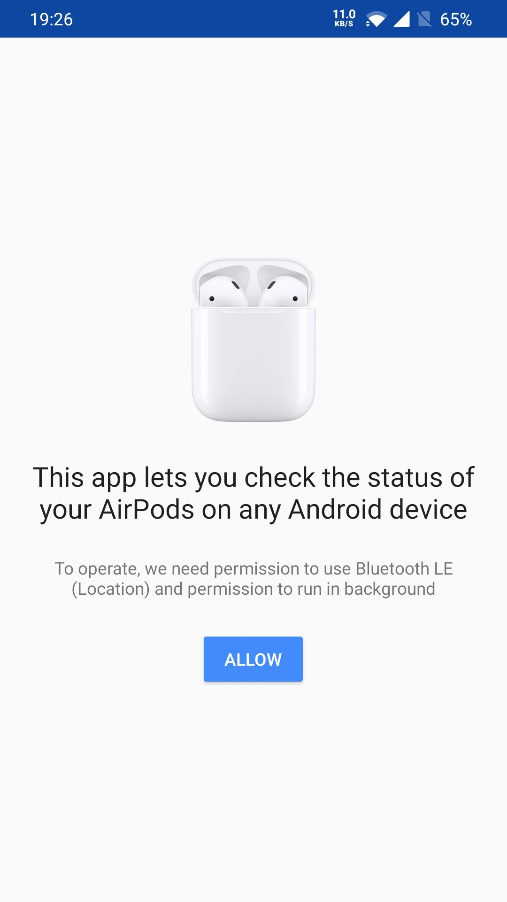
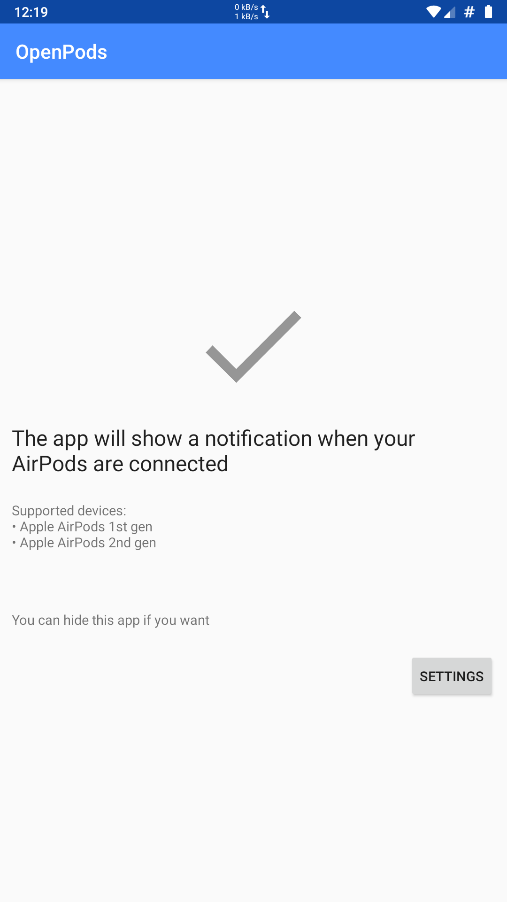

# OpenPods
The Free and Open Source app for monitoring your AirPods on Android

## Download

[Download APK](https://downloads.fdossena.com/geth.php?r=openpods-apk)

## Features
* Shows a notification with AirPods status when they are connected
* Respects your privacy
* Free and Open Source software

## Supported devices
* Apple AirPods 1st gen
* Apple AirPods 2nd gen
* Apple AirPods Pro

## DO NOT REUPLOAD TO GOOGLE PLAY
**This app violates Google Play policies and is designed to break if you try to fix that unless you really know what you're doing.** You have been warned. I do NOT want this app to be on Google Play.

I had to do this because several people were redistributing modified proprietary versions of this app on Google Play in violation of the GNU GPLv3 license.

## Donate
[Donate with PayPal](https://www.paypal.me/sineisochronic)

## Screenshots
  
  

## License
Copyright (C) 2019 Federico Dossena

This program is free software: you can redistribute it and/or modify
it under the terms of the GNU General Public License as published by
the Free Software Foundation, either version 3 of the License, or
(at your option) any later version.

This program is distributed in the hope that it will be useful,
but WITHOUT ANY WARRANTY; without even the implied warranty of
MERCHANTABILITY or FITNESS FOR A PARTICULAR PURPOSE.  See the
GNU General Public License for more details.

You should have received a copy of the GNU General Public License
along with this program.  If not, see <http://www.gnu.org/licenses/>.

AirPods is a trademark of Apple inc.
