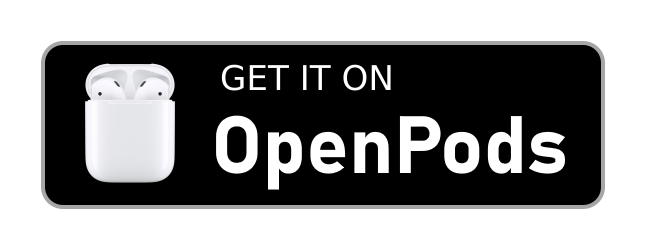

<p align="center"></p> 
<h1 align="center"><b>OpenPods</b></h1>
<h4 align="center">The Free and Open Source app for monitoring your AirPods on Android</h4>
<p align="center">
	<a href="https://github.com/adolfintel/OpenPods/releases">
		
	</a>
	<a href="https://www.gnu.org/licenses/gpl-3.0">
		
	</a>
	
</p>
<p align="center">
	<a href="https://f-droid.org/packages/com.dosse.airpods">
		
	</a>
	<a href="https://downloads.fdossena.com/geth.php?r=openpods-apk">
		
	</a>
</p>

## Screenshots

[](fastlane/metadata/android/en-US/images/phoneScreenshots/screen1.png)
[](fastlane/metadata/android/en-US/images/phoneScreenshots/screen2.png)
[](fastlane/metadata/android/en-US/images/phoneScreenshots/screen3.png)
[](fastlane/metadata/android/en-US/images/phoneScreenshots/screen4.png)
	
## Features

* Shows a notification with AirPods status when they are connected
* Respects your privacy
* Free and Open Source software
* Supports Dark Theme

## Supported devices

* Apple AirPods 1st gen
* Apple AirPods 2nd gen
* Apple AirPods 3rd gen
* Apple AirPods Pro
* Apple AirPods Pro 2
* Apple AirPods Max
* Beats X
* Beats Flex
* Beats Solo 3
* Beats Studio 3
* Powerbeats 3
* Powerbeats Pro

## Integration
This app can post broadcast intents that can be read by any apps on the same device.

To register for a broadcast receiver:

**AndroidManifest.xml**
```xml
<receiver android:name=".AirpodReceiver"
    android:exported="true">
    <intent-filter>
        <action android:name="com.dosse.airpods.status"/>
    </intent-filter>
</receiver>
```

**Receiver**
```java
public class AirpodReceiver extends BroadcastReceiver {
    @Override
    public void onReceive(Context context, Intent intent) {
        if (intent.getAction().equals("com.dosse.airpods.status")) {
           // Do something with "intent.getExtras()" here
        }
    }
}
```

**Register Receiver**
```java
IntentFilter airpodFilter = new IntentFilter("com.dosse.airpods.status");
AirpodReceiver airpodReceiver = new AirpodReceiver();
registerReceiver(airpodReceiver, airpodFilter);
```

**Intent Extras**

Primary action: `com.dosse.airpods.status` contains the following intent extras:

| Intent Extra      | Type | Description                                                                                                                                      |
|-------------------| ---- |--------------------------------------------------------------------------------------------------------------------------------------------------|
| isAllDisconnected | boolean | True if airpod (including case, left pod, right pod) lost connection, otherwise false                                                            |
| model             | String | Model of the airpod                                                                                                                              |
| isSingle          | boolean | True if the model is single (ie. Beats Studio, Beats Solo, etc.)                                                                                 |
| leftPodStatus     | String | Battery percentage (with % suffix) of the left pod if it is connected, blank if disconnected. **Only applicable for non-single pod models**      |
| rightPodStatus    | String  | Battery percentage (with % suffix) of the right pod if it is connected, blank if disconnected. **Only applicable for non-single pod models**     |
| caseStatus        | String  | Battery percentage (with % suffix) of the charging case if it is connected, blank if disconnected. **Only applicable for non-single pod models** |
| singlePodStatus   | String  | Battery percentage (with % suffix) of the airpod if it is connected, blank if disconnected. **Only applicable for single pod models**            |
| leftPodInEar      | boolean | If left pod is detected to be in ear. **Only applicable for non-single pod models**                                                              |
| rightPodInEar     | boolean | If right pod is detected to be in ear. **Only applicable for non-single pod models**                                                             |

## DO NOT REUPLOAD TO GOOGLE PLAY
**This app violates Google Play policies and is designed to break if you try to fix that unless you really know what you're doing.**<br />
Legal actions can and will be taken when uploading a compiled version to the Google Play Store that does not comply with the terms and conditions of the app's license. As a result, you may no longer be able to publish apps to the Google Play Store. This app is not intended to be uploaded to the Google Play Store. The developer is legally allowed to demand compensation.

This paragraph was added due to multiple license violations found on the Google Play Store. If you're not sure whether you're allowed to distribute your modified version, please contact the developer.

## Donate
<a href="https://www.paypal.me/sineisochronic"></a>

## License
[](https://www.gnu.org/licenses/gpl-3.0.en.html)  

This program is free software: you can redistribute it and/or modify
it under the terms of the GNU General Public License as published by
the Free Software Foundation, either version 3 of the License, or
(at your option) any later version.

This program is distributed in the hope that it will be useful,
but WITHOUT ANY WARRANTY; without even the implied warranty of
MERCHANTABILITY or FITNESS FOR A PARTICULAR PURPOSE.  See the
GNU General Public License for more details.

You should have received a copy of the GNU General Public License
along with this program.  If not, see <http://www.gnu.org/licenses/>.

&nbsp;
&nbsp;

Copyright (C) 2019-2022 Federico Dossena

AirPods is a trademark of Apple inc.
